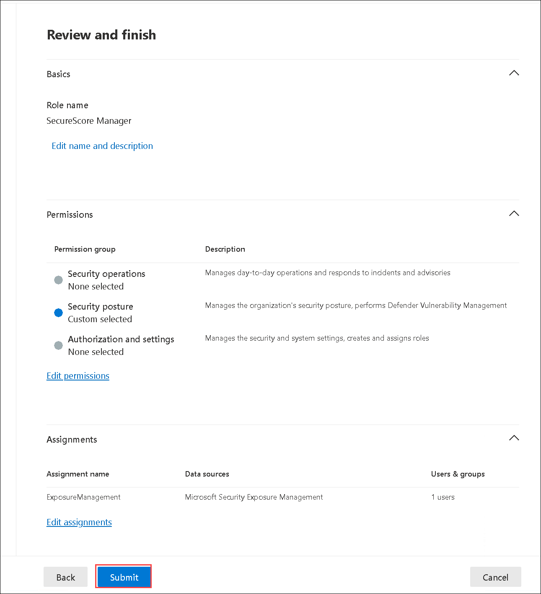
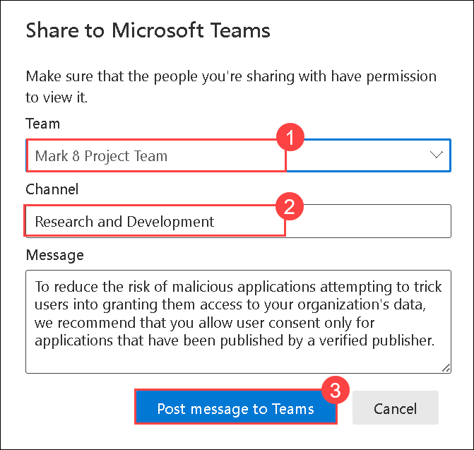

# Security Posture Management

Contoso's security team wants to improve its security posture by using Microsoft Secure Score, a tool that provides recommendations and guidance on how to reduce the attack surface and protect against threats.

The security team reviews and delegates Secure Score recommended actions to its extended team members (security ambassadors) that manage the status and action plan associated with improvement actions. The security team also wants to control access to security posture information and the data sources that feed it. Joni Shermann is one of the security ambassadors and needs access to exposure management.

Recently, there have been reports that uninvited associates were automatically being admitted to Teams calls to which they were not directly invited.  Due to the sensitive and confidential nature of calls, the security team want to control this.

## Part 1: Design a solution

### Design approach

The recommended actions tab in Microsoft Secure Score lists the security recommendations that address possible attack surfaces. Those actions can be shared/delegated.

Security teams need to control access to the organization's security posture information and to the specific data sources that feed it. The Microsoft Defender XDR Unified role-based access control (RBAC) model provides a single permissions management experience that provides one central location for administrators to control user permissions across different security solutions.

To ensure that the security ambassadors have the necessary role permissions, you need to create a custom role. For the Microsoft Defender XDR security portal to start enforcing the permissions and assignments configured in your new custom roles or imported roles, you must activate the Microsoft Defender XDR Unified RBAC model for some or all of your workloads.

### Proposed solution

|Requirement|Solution|Action plan|
|----|----|----|
|Joni Shermann will manage actions and status associated with Security Score recommendations. |Exposure Management - Secure Score and Defender XDR unified RBAC | Create role to manage security posture and grant access to Joni Shermann. |
|Control access to security posture information and the data sources that feed it. | Microsoft Defender XDR Unified RBAC | Activate Microsoft Defender XDR Unified RBAC for custom role. |
|Share Secure Score recommended action |Secure Score | Share recommended action. |

## Part 2: Implement the solution 

### Task 1 - Create a custom role to manage security posture for Exposure Management

In this task, you'll set up custom role focused on security posture and more specifically on Exposure Management. As part of the custom role, you'll grant Joni Shermann access to the data source for Exposure Management.

1. Ensure you are logged into the **MICROSOFT AZURE: lON-SC1** VM by default. To switch between virtual machines, select the desired VM from the dropdown menu. 

   

1. Open a new tab in **Microsoft Edge**, select the address bar, navigate to **`https://security.microsoft.com`** and log into the Entra ID Portal with the below credentials if prompted.

    - **Email/Username:** <inject key="AzureAdUserEmail"></inject>
    - **Password:** <inject key="AzureAdUserPassword"></inject>

1. On the **Stay signed in?** dialog box, select the **Don’t show this again** checkbox and then select **No**.

1. Close the password save dialog from the bottom by selecting **Never**, to not save the default global admins credentials in your browser.

1. If you see an information box on the top right of the screen that says **Manage multifactor authentication**, close it by selecting the **X**.

1. On the left navigation pane, scroll down to bottom then select **Permissions**.

1. If this is the first time you are accessing Microsoft Defender settings, you will have to wait a few minutes while Defender prepares new spaces for your data and connects them.  Once that completes, refresh the permissions page until you see a listing that includes Microsoft Defender XDR, Microsoft Entra ID, Endpoints roles & groups, Email & collaboration roles, and Cloud Apps. It may take some time for all of these to show up.

1. If a pop-up page appears with the message **Welcome to Microsoft Defender for Business**, click **Get Started** and follow steps 9 and 10. If it does not appear, proceed directly to step 6.

    

1. Click **Skip** on the **Assign User Permission** page and the **Setup Email Notification** page.

1. Click **Continue** on the **Add Windows devices and Apply security settings** page, and then click **Submit**.

1. Under **Microsoft Defender XDR(1)**, select **Roles**.

   

1. Select **Create custom role**.

   

1. In the Role name field, enter **`SecureScore Manager`** then select **Next**.

   

1. Select **Security posture**.

1. In the Security posture window:
    - Select **Select custom permissions**
    - Under Posture management select **Select custom permissions**
    - Choose **Exposure Management (manage)**
    - Select **Apply**.
    - Select **Next**.

     

1. On the **Assign users and data sources** page, select **Add assignment** then populate the fields as follows then click on **Next**:

    

    - Assignment name: **`ExposureManagement`**
    - Assign users and group: Enter **`Joni Sherman`**, then select it.
    - Under **Data sources**, select the drop-down menu to see a list of the available data-sources. Select only **Microsoft Security Exposure Management**.  If other data sources are listed, unselect them.
    - Select, **Add**. 

          

1. In the Review and finish page review your settings, select **Submit**, then select **Done**.

     

1. You should be on the **Permissions and roles** page and see the custom role you just created. Keep this tab open, you'll come back to it in the next task.

      

You successfully set up a custom role for security posture that grants Joni Shermann access to the Exposure Management data source.

### Task 2 - Activate Defender XDR unified RBAC for specific workloads

For the Microsoft Defender XDR security portal to start enforcing the permissions and assignments configured in your new custom roles, you must activate the Microsoft Defender XDR Unified RBAC model for your workloads.

When you activate some or all of your workloads to use the new permission model, the roles and permissions for these workloads are fully controlled by the Microsoft Defender XDR Unified RBAC model in the Microsoft Defender portal.

In this task you´ll explore the page where workloads are activated.

1. You should still be logged into the Microsoft Defender portal and be in the **Permissions and roles** page. You should see the custom role you just created.

   

1. Note the information in the gray banner, Some of the roles aren't applicable yet, because you haven't activate all workloads. Select **Activate workloads**.

   

1. Note the description under **Activate unified role-based access control**.  When you activate some or all of your workloads to use the new permission model, the roles and permissions for these workloads are fully controlled by the Microsoft Defender XDR Unified RBAC model in the Microsoft Defender portal.
 
    

1. For this exercise, the data source for Exposure Management is enabled by default, which is why there is no setting to enable that workload. If you had created a custom role that included permissions for other workloads, such as Office 365 or Device and Vulnerability Management, as examples, then you would need to activate those specific workloads to activate the custom role, as part of unified RBAC.

You learned where to activate the Microsoft Defender XDR Unified RBAC model for some or all of your workloads.

### Task 3 - Share a recommended action

Share a Microsoft Secure Score recommended action. In this task you'll post the action on a Teams channel. By posting it on Teams, users on the channel will see a notice but will not have access to the data source to edit the status or manage the action. Only Joni Shermann who is a member of the Teams channel and has role permissions can access the recommended action.

1. You should still be logged into Microsoft Defender XDR portal.

1. On the left navigation pane, expand **Exposure management** then select **Secure Score**.

1. If a pop-up page appears with the message **Welcome to Microsoft Defender for Business**, click **Get Started** and follow steps 4 and 5. If it does not appear, proceed directly to step 6.

    

1. Click **Skip** on the **Assign User Permission** page and the **Setup Email Notification** page.

1. Click **Continue** on the **Add Windows devices and Apply security settings** page, and then click **Submit**.

1. Select the **Recommended actions** tab.

1. Select any **Recommended actions** with a status of **To address**

   

1. Select **Share**, and in the dropdown menu select **Microsoft Teams**.

1. In field **Team** select **Mark 8 Project Team (1)** and in the **Channel** field select **Channel Research and Development (2)**.

1. Select **Post message to Teams (3)**.

   

Joni Sherman and her Mark 8 Project Team will be notified about the recommended action in the Teams channel.

### Task 4 - Manage Recommendations

As Joni Sherman you received the teams notification that a specific action to increase the organization's security posture was recommended.  As an extended member of the security team you have the role permissions to manage the recommended action and document the solution.

In this task, you´ll manage recommended action and document your solutions.

1. Open a Microsoft Edge InPrivate window, navigate to **`https://office.com`** and sign in as 
    - **Email/Username:** **<inject key="User 10 UPN"></inject>**

    - **Password:** **<inject key="User 10 Password"></inject>**

1. If the landing page appears blurred out, refresh the page.

1. Select the app launcher icon, located to the left of the top banner that says Contoso Electronics, and select **Teams**.

   
    

1. On the Welcome to Teams window, select **Get Started**. It may take a minute or two for Teams to set up. If a Teams for Mobile QR-code screen pops-up, close it.

1. Open Teams. For the **Mark 8 Project Team** select **See all channels** then select **Research and Development**.

1. Review the message posted from the previous task.

1. From the posted message, select the link.  Because you, Joni Shermann, have been granted permission through the custom role, you are able to access Secure Score.  Other members of the Mark 8 project team can see teh post, but do not have access to Secure Score.
  
    

1. Select **Edit status & action plan**.

     

1. Check **Resolved through third party**.

1. Add a note **Currently secured** to the **Action plan** field.

1. Select **Save and Close**.

1. Close the inPrivate browser tabs.

As Joni Shermann, you successfully edited the status for the recommended action.

### Task 5  - Adele Vance accesses the Teams post

In this task, Adele Vance access the Mark 8 Project Team channel and selects the link in the posted message.

1. Open a Microsoft Edge InPrivate window, navigate to **`https://office.com`** and sign in as Adele Vance, 

- **Email/Username:** **<inject key="User 06 UPN"></inject>**.

- **Password:** **<inject key="User 06 Password"></inject>**

1. If the landing page appears blurred out, refresh the page.

1. Select the app launcher icon, located to the left of the top banner that says Contoso Electronics, and select **Teams**.

1. On the Welcome to Teams window, select **Get Started**.

1. Open Teams. For the **Mark 8 Project Team** select **See all channels** then select **Research and Development**.

1. Review the message posted from the previous task.

1. Select the link in the posted message 

    

1. You are taken directly to Microsoft Secure Score, but you don't have permission to access this data, as Adele Vance was not added as a member to the custom role that you created.

    

1. Close the InPrivate browser tabs.

In this task, you confirmed that members of the Mark 8 Project can see the message posted for the recommended action to help improve the organization's security posture, but only those associates that have been added to the custom role can access the Secure Score information.
