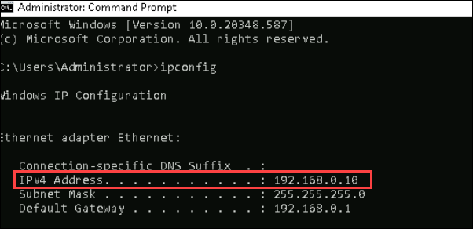
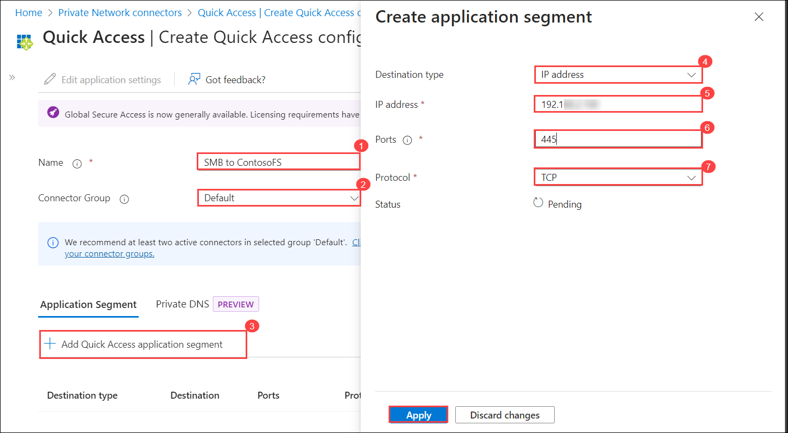
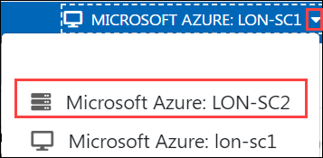
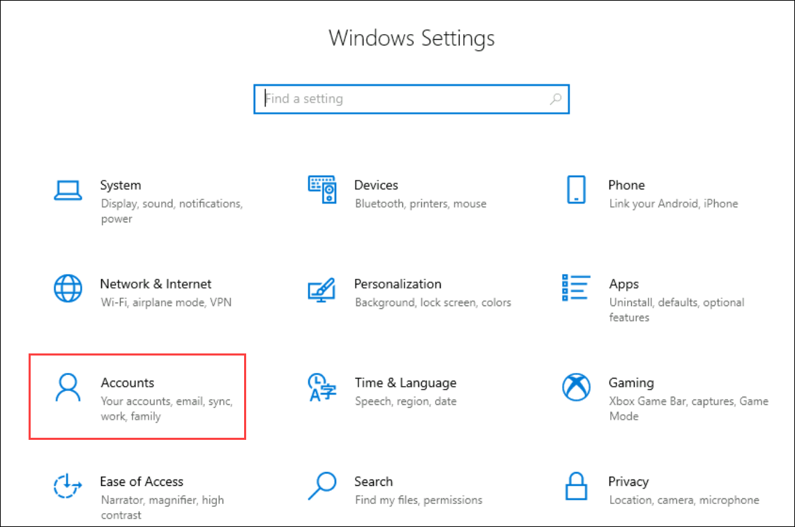
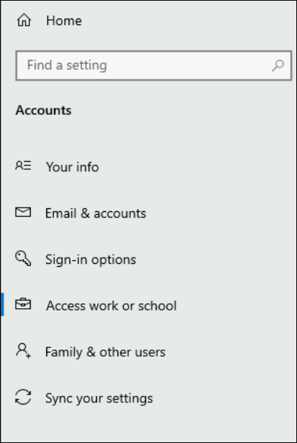
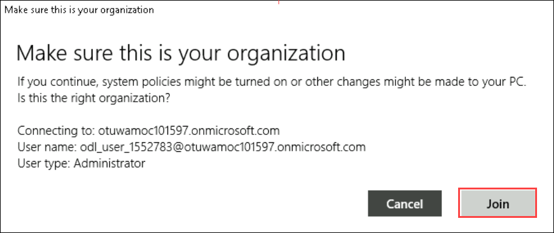
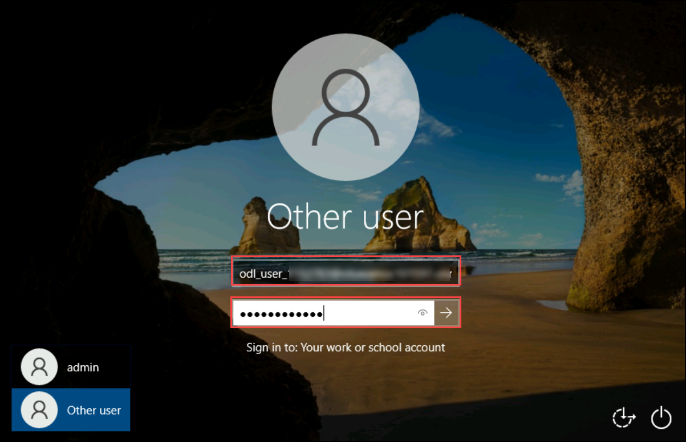
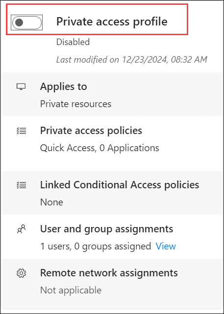
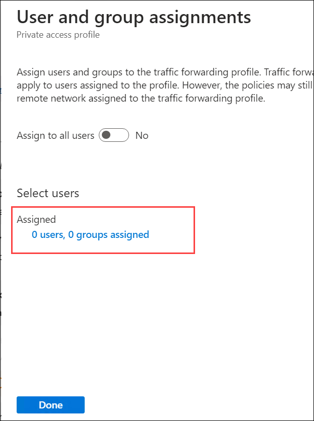
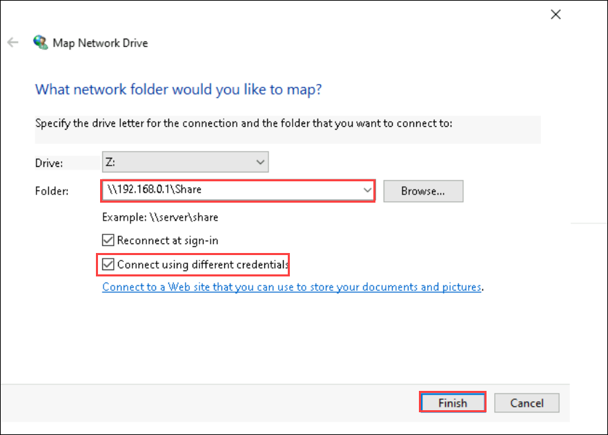

# Global Secure Access

After setting up a monitoring server, you need to establish secure networking to the file server using Global Secure Access (GSA). You want to ensure that access to these machines is secured until these file servers can be migrated to secure cloud storage, especially if Tailwind Traders is bringing local servers into your company IT infrastructure. You decided against reworking the VPN infrastructure of Tailwind Traders to allow your employees access to the servers. 

To establish secure networking, you will start by creating an Azure App Proxy and enrolling the client to Entra ID, before creating a connector. After that, you will configure an access policy and install the GSA client. Finally, you will test the GSA connection to ensure that everything is working properly.

## Part 1: Design a solution (required)

In this task you will secure remote access to your on premise environment.

### Design approach

The initial step involves analyzing the requirements based on the described scenario, understanding the objectives and defining the requirements.

Based on the provided use-case, the following requirements can be outlined:

- Enable secure remote access for on premise servers
- Integrate with existing infrastructure
- Do not use deprecated infrastructure of Tailwind Traders

Global Secure Access integrates with the existing cloud infrastructure of Contoso Ltd. and allows your employees to securely remote into local servers within Tailwind Traders local infrastructure. Review GSA and consider the differences to other strategies for remote access to services.

### Proposed solution

|Requirement|Solution|Action plan|
|----|----|----|
|Enable secure remote access for on premise servers| EntraID Global Secure Access | Enable Global Secure Access  |
|Integrate with existing infrastructure | Application Proxy | Deploy Application proxy on Contoso´s Fileserver |

## Part 2: Implement the solution

### Task 1: Activate Global Secure Access

The first step is to activate Global Secure Access in your tenant.

1. Make sure you are on the **MICROSOFT AZURE:lON-SC1** VM.

1. Open a new tab in **Microsoft Edge**, select the address bar, navigate to **`https://entra.microsoft.com`** and log into the Entra ID Portal with the below credentials if prompted.

    - **Email/Username:** <inject key="AzureAdUserEmail"></inject>
    - **Password:** <inject key="AzureAdUserPassword"></inject>

1. On the **Stay signed in?** dialog box select the **Don’t show this again checkbox** and then select **No**.

1. On the **Save password** dialog box, select **Not now**.

1. If **Sign into Microsoft Edge** dialog box appears, select **No thanks**.

1. If you see an information box on the top right of the screen that says **Manage multifactor authentication**, close it by selecting the **X**.

1. In the left navigation pane expand **Global Secure Access** and select **Dashboard**.

1. Under **Activate Global Secure Access in your Tenant** select **Activate**.

   
    
You have successfully activated Global Secure Access.

### Task 2: Enable TLS and install the private network connector

The private network connector is a lightweight agent that is installed on a Windows Server, in your on-premise environment, that has access to the backend resources and applications, and is used to facilitate the connection to the Global Secure Access service.  The Windows server where the connector will be installed must have TLS 1.2 enabled before you install the private network connector.

1. Before you install the private network connector on the server, you need to enable TLS 1.2.  There are several ways you can do this. For this exercise, you'll copy the commands to set the registry keys into a file and then run that file.

1. Open **Microsoft Edge**.

1. On a browser tab, enter the URL: **`https://learn.microsoft.com/en-us/entra/global-secure-access/how-to-configure-connectors`** then press the enter key on your keyboard to open the product documentation.

1. Scroll-down to the section **Transport Layer Security (TLS) requirements** and from the code box listed under **Set registry keys**, select **Copy**.

    
    
1. From within the VM, you'll open Notepad. In the taskbar's search field, type **`Notepad`**, then select **Notepad** to open the application.

    

1. Use **Ctrl + v** to paste the code into Notepad.  Do NOT change anything in the pasted code. The first line of code is required.

1. From Notepad, select **File** then select **Save as**. 

    

1. In the **Save as type** field, select **All files** from the drop-down, and in the **File name** field enter **`EnableTLS.reg`**, then select **Save**.  It's important that you save the file with the .reg extension. Take note of where the document is saved then close Notepad.

   

1. From the taskbar, open **File Explorer** and navigate to the folder where you saved the file (the default is This PC > Documents).

1. Double click the file name, **Enable-TLS** to run it.  

    

1. Because you are changing the registry file, you are asked, **Are you sure you want to continue?**  Select **Yes**, then select **Ok**. 

    

 1. Since you updated the registry, you'll need to restart the server. From the taskbar of the Server VM, select the  **Windows icon**, select **Power**, select **Restart**.

    

1. After the restart click on **reconnect**, log back in to the Server VM, as the local **Administrator** and password **Pa55w.rd** .

1. Minimize or close Server Manager.

1. Open **Microsoft Edge**, select the address bar, navigate to **`https://entra.microsoft.com`** .

1. Dismiss the dialog boxes, as you did in the previous task.

1. From the left navigation panel, expand **Global Secure Access**, expand **Connect**, and select **Connectors**.

1. From the top of the Private Network connectors page, select **Download connector service**.
1. Review the information then select **Accept terms & Download**.

    

1. From the downloads window on the top right corner of the page, when the download is complete, select **Open file**.  If the downloads window closed before you were able to select Open file, select **File explorer** from the taskbar, go to the **Downloads** folder, then run the file **MicrosoftEntraPrivateNetworkConnectorInstaller**.

   

1. Select the box next to **I agree to the license terms and conditions** then  select **Install**.

   

1. During the installation process you have to sign in with the **Username:** <inject key="AzureAdUserEmail"></inject> and **Password:** <inject key="AzureAdUserPassword"></inject> . It can take a couple of minutes to complete the installation.

   >**Note:** If you get pop-up that website is blocked by Internet explorer for below website then click on **Add** for both and then close as shown in below images.

   

   

   

1. Once the installation is complete **Close** the installation window and refresh the browser page.  You should see the connector listed and active.

1. In the Windows search bar, on the task bar, enter **`cmd`** then select **Command Prompt**.

   

1. In the Administrator: Command Prompt window, run the **`ipconfig`** command.

    

1.  Make note of the private ip address for your server, then close the Command Prompt window. You've successfully installed the private network connector on your on-premise server.

    

### Task 3: Create a folder on the File Server

In this task, you´ll create an SMB Share on the on-premise file server that will be accessed thru GSA.

1. You should still be logged in to .

1. From the task bar, open **File Explorer**, navigate to the C: Drive and create a folder named **Share**.

    

1. Using the right mouse key, select the **Share** Folder and select **Properties**.

    

1. From the Share Properties window, select the **Sharing** tab and select **Share...**.

    

1. From the dropdown, select **Everyone** and select **Add**.

   

1. Select **Share**.

1. Select **No, make the network that I am connected to a private network**.

1. Select **Done** .

    

1. Select **Close** and minimize or close File explorer.

You've created a shared folder on the server. It is this folder and its content that you'll access through GSA.

### Task 4: Setup Quick Access and assign User

Private Access provides two ways to configure the private resources that you want to tunnel through the service. Quick Access or Global Secure Access applications. For this exercise, you'll use Quick Access.

Quick Access is the primary group of FQDNs and IP addresses that you want to secure. When you configure the Quick Access, you're creating a new enterprise application that serves as a container for the private resources that you want to secure.

In order for your users to access the resources the file server through the GSA client you need to enable Quick Access and assign it to your test users.

1. You can stay in MICROSOFT AZURE: lon-sc1 for this step.

1. Naviaget back to **Entra Admin Center** and in the left navigation pane expand **Global Secure Access**, expand **Applications**, then select **Quick Access**. Enter the following information:

    - Name: **`SMB to ContosoFS`**
    - Connector Group: **Default**

1. Select **Add Quick Access application segment** and fill in the following information:

    - Destination type: **IP address**
    - IP address: the private IP address of your server that you noted in the earlier step,
    - Ports: **`445`**

1. Select **Apply**.

   

1. Select **Save**. Once you see the status field for the application segment show success, refresh the browser page. Upon refreshing the page, you're taken to the **Quick Access | Network access properties** page.

1. On the left select **User and groups**.

1. Select **Add user/group**.

   

1. Select **None Selected**.

1. In the search field, enter **<inject key="AzureAdUserEmail"></inject>**, then select it from the search results.

1. From the bottom of the page, press **Select**.

    

1.  On Add Assignment page, select **Assign**.

    

You have successfully enabled quick access for your test user.

### Task 5: Device join Entra ID

In order to use Global Secure Access, you need to join the client endpoint, the LON-SC2 VM, to Microsoft Entra ID. Otherwise the GSA client will not work.

1. To Switch between the Virtual Machines, select the Microsoft AZURE: LON-SC2 VM from the dropdown.

    

1. Log into the MICROSOFT AZURE: LON-SC2 VM, using the username **Administrator** account and the password **Pa55w.rd**

1. Using the right mouse key, select the Windows icon in the task bar and select **Settings**.

1. In the **Windows Settings** page, select **Accounts**.

     

1. From the Accounts page from the left navigation pane, select  **Access work or school**.

     

1. To add a work or school account select **Connect**.

1. From the bottom of the window, select **Join this device to Microsoft Entra ID**.

1. Sign in with your **ODL_USER** admin credentials provided by the lab provider.

    - **Email/Username:** <inject key="AzureAdUserEmail"></inject>
    - **Password:** <inject key="AzureAdUserPassword"></inject>

1. From the **Make sure this is your organization** window, review the information then select **Join**.

    

1. Review the information on the **You're all set** window and select **Done**.

1. Now that your device is Entra ID joined with you <inject key="AzureAdUserEmail"></inject> account, you need to log in using that account.

1. From the taskbar, select the **Windows** icon, select **Admin**, then select **Sign out**.

1. Click on **Reconnect** and From the bottom left of the window, select **Other user**, then log in with your **Email/Username:** <inject key="AzureAdUserEmail"></inject> ,**Password:** <inject key="AzureAdUserPassword"></inject>.

      

Once your endpoint is joined to Entra ID you will be able to set up the GSA client which is used to connect to any resources you are protecting with Global Secure Access.

### Task 6: Activate the traffic forwarding profile and download the GSA desktop client

To enable access to private resources or applications in your on-premises environment, you need to enable the traffic forwarding profile for Private Access and assign users.

You also need to download and install the Global Secure Access desktop client.  

Private access traffic can be forwarded to the service by connecting through the Global Secure Access desktop client.

1. You should still be on **LON-SC2**, to which you have signed in with the your <inject key="AzureAdUserEmail"></inject> account.

1. Open **Microsoft Edge**. You'll be prompted to setup Microsoft Edge.

1. From the Microsoft Edge, navigate to **`https://entra.microsoft.com`**.

    - **Email/Username:** <inject key="AzureAdUserEmail"></inject>
    - **Password:** <inject key="AzureAdUserPassword"></inject>

1. From the left navigation panel, expand **Global Secure Access**, expand **Connect** and choose **Traffic forwarding**.  You may need to expand the left navigation panel by selecting **>>** to view the options.

1. Select the slider button next to **Private access profile** then select **OK**.

    

1. Now that you've enabled the private access profile, you'll need to assign users.

1. From the Private access profile card, under **User and group assignments**, select **View**.

1. Select where it says **0 users, 0 groups assigned**.

   

1. Select **Add user/group**.

1. Select **None Selected**.

1. In the search bar, enter **<inject key="AzureAdUserEmail"></inject>**, select **<inject key="AzureAdUserEmail"></inject>**, press **Select**, then select **Assign**.

1. In the left navigation pane under **Connect** choose **Client download**.

1. Under Windows 10/11, select **Download client**.

1. From the Downloads window, select **Open file**. If the downloads window closed before you were able to select Open file, select **File explorer** from the taskbar, go to the **Downloads** folder, then run the file **GlobalSecureAccessClient**.

1. Select **I agree to the license terms and conditions**, then select **Install**. In the User Account Control window that pops up, select **Yes**.

     

1. Once the installation successfully completes, **Close** the window.

1. From the task bar, select the up arrow to show hidden icons.  Here you will see the Global Secure Access client icon. If it does not have a green checkmark, right-click the icon and select **Enable**. It may take 60 minutes to show with a green checkmark to indicate it is connected.

1. From the task bar, select **File Explorer** and navigate to **This PC**. Select the ellipses (**...**) and select **Map network drive**.

1. In the Folder field, enter `\\192.168.*.*\Share`. Use the IP address you are noted earlier AND select **Connect using different credentials**.

1. Select **Finish**.

     

1. To map the network drive, use the credentials for the local administrator account on MICROSOFT AZURE: lon-sc1. 

1. Email field: **<inject key="VM Username"></inject>**.

1. Password field: **<inject key="VM Password"></inject>**.

You have successfully connected to the file server by using Global Secure Access.
